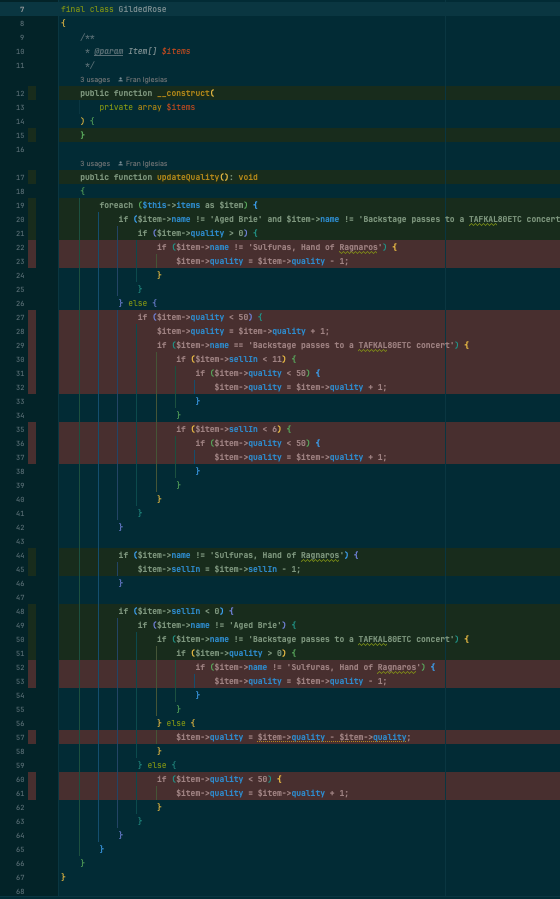

# The Golden Master technique, with approval mode

In this recipe we will learn how to use Golden to use the Golden Master technique to generate a lot of tests covering 100% of a legacy code that we need to refactor.

## The problem

The problem is representative of a common situation. We have an important piece of code that we are afraid to touch because it applies a lot of business rules. We have to add new rules and business objects, but we don't know how to do it because of the complexity. To make things worse we don't have tests to try to refactor it. 

## The example

The code exercise we are going to use for this recipe is the [Gilded Rose Refactoring](https://github.com/emilybache/GildedRose-Refactoring-Kata) kata, using the version published by Emily Bache. This version uses the approvals test library, so we are going to remove it and use **php-golden** instead.

## Preparation

Install the library if you have not done so before.

```shell
composer require --dev franiglesias/golden
```

Don't forget to execute the installer to get all the dependencies.

```shell
composer install
```

At the time of writing the current version is v0.1.0. You probably will be using v1.*, but we will not have significant API changes.

## Examining the challenge

The project comes with a test as starting point:

```php
class GildedRoseTest extends TestCase
{
    public function testFoo(): void
    {
        $items = [new Item('foo', 0, 0)];
        $gildedRose = new GildedRose($items);
        $gildedRose->updateQuality();
        $this->assertSame('fixme', $items[0]->name);
    }
}
```

If you run it, you will see that it fails. It's on purpose, to make sure that you can run the tests, and to help you understand how the thing is tested. You can fix it if you want.

I don't want to show you the code of the GildedRose class right now. Let's see what we can guess from the test.

The first thing that catches my eye is that the method under test `$gildegRose->updateQuality()` returns nothing. So, where are the outcomes?

If you read the assertion you see that we are checking the first and unique element of the `$items` array. It's an array or collection of `Item` objects. Item is not a very complex object, by the way:

```php
class Item implements Stringable
{
    public function __construct(
        public string $name,
        public int $sellIn,
        public int $quality
    ) {
    }

    public function __toString(): string
    {
        return (string) "{$this->name}, {$this->sellIn}, {$this->quality}";
    }
}
```

It carries the information that describes the state of an Item and provides a `__toString()` to represent it.

When we invoke the `$gildedRose->updateQuality()` we process the list with all the items that it contains getting back the changes. So we can examine the list after exercising that method to see the state.

Ok, so: What is this GildedRose doing? The GildedRose object examines all the items that are contained in the collection and updates the `quality` property, and the `sellIn` property, according to several rules that are described in the [GildedRose requirements](https://github.com/emilybache/GildedRose-Refactoring-Kata/blob/main/GildedRoseRequirements.md).

```
All items have a SellIn value which denotes the number of days we have to sell the items.
All items have a Quality value which denotes how valuable the item is.
At the end of each day our system lowers both values for every item.

Pretty simple, right? Well this is where it gets interesting:

* Once the sell by date has passed, Quality degrades twice as fast
* The Quality of an item is never negative
* "Aged Brie" actually increases in Quality the older it gets
* The Quality of an item is never more than 50
* "Sulfuras", being a legendary item, never has to be sold or decreases in Quality
* "Backstage passes", like aged brie, increases in Quality as its SellIn value approaches; Quality increases by 2 when there are 10 days or less and by 3 when there are 5 days or less but Quality drops to 0 after the concert
```

The motivation for the changes is this new requirement:

```
We have recently signed a supplier of conjured items. This requires an update to our system:

* "Conjured" items degrade in Quality twice as fast as normal items
```

So, before introducing the Conjured items, we need to refactor things, because this is how the code looks... Not very nice.

```php
final class GildedRose
{
    /**
     * @param Item[] $items
     */
    public function __construct(
        private array $items
    ) {
    }

    public function updateQuality(): void
    {
        foreach ($this->items as $item) {
            if ($item->name != 'Aged Brie' and $item->name != 'Backstage passes to a TAFKAL80ETC concert') {
                if ($item->quality > 0) {
                    if ($item->name != 'Sulfuras, Hand of Ragnaros') {
                        $item->quality = $item->quality - 1;
                    }
                }
            } else {
                if ($item->quality < 50) {
                    $item->quality = $item->quality + 1;
                    if ($item->name == 'Backstage passes to a TAFKAL80ETC concert') {
                        if ($item->sellIn < 11) {
                            if ($item->quality < 50) {
                                $item->quality = $item->quality + 1;
                            }
                        }
                        if ($item->sellIn < 6) {
                            if ($item->quality < 50) {
                                $item->quality = $item->quality + 1;
                            }
                        }
                    }
                }
            }

            if ($item->name != 'Sulfuras, Hand of Ragnaros') {
                $item->sellIn = $item->sellIn - 1;
            }

            if ($item->sellIn < 0) {
                if ($item->name != 'Aged Brie') {
                    if ($item->name != 'Backstage passes to a TAFKAL80ETC concert') {
                        if ($item->quality > 0) {
                            if ($item->name != 'Sulfuras, Hand of Ragnaros') {
                                $item->quality = $item->quality - 1;
                            }
                        }
                    } else {
                        $item->quality = $item->quality - $item->quality;
                    }
                } else {
                    if ($item->quality < 50) {
                        $item->quality = $item->quality + 1;
                    }
                }
            }
        }
    }
}
```

## Golden Master to the rescue

We should put tests in place for refactoring this and not breaking things. The problem is that the business rules are scattered through the code, and it is very difficult to know where to add new ones, without breaking some behavior.

But, how many tests we will need to be sure that we are covering all possible cases? We will need to try lots of combinations of values for items, sell in days and initial and expected quality.

Here is when we can use the Golden Master technique. The idea is simple: generate lots of testing by providing lots of different values for each parameter of the subject under test. You could even try with random values until you reach the 100% coverage of the code.

Once you have 100% coverage, you will know that any change that breaks the functionality will break at least one of the tests.

Fortunately, Golden provides a pretty nice way to set up and generate Golden Master tests. You only have to find the values to try, and Golden will create the combinations, and generate a snapshot of them.

We will use the approval mode for this. In the approval mode, the test never passes and the snapshot is automatically updated for you. This means that you can try things and examine the snapshot and the coverage. When you are happy with all the generated tests, you simply "approve" the current snapshot and you can start refactoring like a champ.

Instead of trying to create a list of items combining all the possible values, we are going to create lots of list of only one item combining this values. The results will be the same for out intent.

## Golden Master with Golden

In Golden we need two things for creating a Golden Master test:

* A function that exercises the subject under test returning the outcome.
* Lists of values for each parameter needed.

So, let's see how. This is the existing test that we are going to transform:

```php
class GildedRoseTest extends TestCase
{
    public function testFoo(): void
    {
        $items = [new Item('foo', 0, 0)];
        $gildedRose = new GildedRose($items);
        $gildedRose->updateQuality();
        $this->assertSame('fixme', $items[0]->name);
    }
}
```

We start by deleting the assertion and changing the name:

```php
class GildedRoseTest extends TestCase
{
    public function testAllBusinessRules(): void
    {
        $items = [new Item('foo', 0, 0)];
        $gildedRose = new GildedRose($items);
        $gildedRose->updateQuality();
    }
}
```

Now, we declare the use of Golden as trait:

```php
class GildedRoseTest extends TestCase
{
    use Golden;
    public function testAllBusinessRules(): void
    {
        $items = [new Item('foo', 0, 0)];
        $gildedRose = new GildedRose($items);
        $gildedRose->updateQuality();
    }
}
```

Let's write the test we want to create first, and then we will move backwards. Something like this:

```php
class GildedRoseTest extends TestCase
{
    use Golden;
    public function testAllBusinessRules(): void
    {    
        $items = [new Item($type, $sellIn, $quality)];
        $gildedRose = new GildedRose($items);
        $gildedRose->updateQuality();

        $this->master($sut, Combinations::of($types, $sellIns, $qualities), waitApproval());
    }
}
```

I will explain what we have in the last line. We invoke the `master` method. This is what `master` does:

* It takes a function in the variable `$sut` that exercises the subject under test.
* `Combinations::of` will generate the combinations of the values passed in the variables `$types`, `$sellIns` and `$qualities`, that will be arrays with possible values for each of the Item properties.
* `waitApproval()` will run the test in approval mode. 

The first three lines in the body of the test contains the "Arrange" and "Action" stages of the test. We need to encapsulate them inside a function that we can pass to the `master` method.

```php
class GildedRoseTest extends TestCase
{
    use Golden;
    public function testAllBusinessRules(): void
    {
        $sut = function () {
            $items = [new Item('foo', 0, 0)];
            $gildedRose = new GildedRose($items);
            $gildedRose->updateQuality();
        };
        
        $this->master($sut, Combinations::of($types, $sellIns, $qualities), waitApproval());
    }
}
```


This function has to accept the parameters that we need to build the `Item` object: its type, its Sell In days and its initial Quality.

So, let's extract them to parameters:

```php
class GildedRoseTest extends TestCase
{
    use Golden;
    
    public function testAllBusinessRules(): void
    {
        $sut = function ($type, $sellIn, $quality) {
            $items = [new Item($type, $sellIn, $quality)];
            $gildedRose = new GildedRose($items);
            $gildedRose->updateQuality();
        };
        
        $this->master($sut, Combinations::of($types, $sellIns, $qualities), waitApproval());
    }
}
```

Now, we need the outcome as string. We are going to use the first and unique Item in the list:

```php
class GildedRoseTest extends TestCase
{
    use Golden;
    
    public function testAllBusinessRules(): void
    {
        $sut = function ($type, $sellIn, $quality) {
            $items = [new Item($type, $sellIn, $quality)];
            $gildedRose = new GildedRose($items);
            $gildedRose->updateQuality();
            return $items[0]->__toString();
        };
        
        $this->master($sut, Combinations::of($types, $sellIns, $qualities), waitApproval());
    }
}
```

We can type hint the parameters in the function.

Now, we need to populate the collections of values. Let's start simple: 

```php
class GildedRoseTest extends TestCase
{
    use Golden;
    public function testAllBusinessRules(): void
    {
        $sut = function (string $type, int $sellIn, int $quality) {
            $items = [new Item($type, $sellIn, $quality)];
            $gildedRose = new GildedRose($items);
            $gildedRose->updateQuality();
            return $items[0]->__toString();
        };

        $types = ['Foo'];
        $sellIns = [0];
        $qualities = [0];

        $this->master($sut, Combinations::of($types, $sellIns, $qualities), waitApproval());
    }
}
```

With this preparation we should be ready to run the test for first time.

## Running the test for the first time

We run the test and a snapshot file will be generated at: `__snapshots/GildedRoseTest/test_all_business_rules.snap.json` inside the same folder of the test, containing this:

```json
[
    {
        "id": 1,
        "params": [
            "Foo",
            0,
            0
        ],
        "output": "Foo, -1, 0"
    }
]
```

As we can see, for a general `Item`, sellIn decreased one unit and quality remains zero, because there is a rule that states:

```
* The Quality of an item is never negative
```

Nice! We have a test. But, how good is it?

If we run the test with Coverage, we can see that there a lot of code that was not exercised. In fact, only 54.55% of branch coverage is achieved.



So, we need to find new values to try.

## How to find values for Golden Master

You can have several sources of interesting values.

### From the requirements and business rules

```
* Once the sell by date has passed, Quality degrades twice as fast
* The Quality of an item is never negative
* "Aged Brie" actually increases in Quality the older it gets
* The Quality of an item is never more than 50
* "Sulfuras", being a legendary item, never has to be sold or decreases in Quality
* "Backstage passes", like aged brie, increases in Quality as its SellIn value approaches; Quality increases by 2 when there are 10 days or less and by 3 when there are 5 days or less but Quality drops to 0 after the concert
```

* The first rule tells us that `sellIn==0` is important. 
* `quality==0` is also a significant value, because is a limit. The same goes for `quality==50`.
* "Aged Brie" is a type of Item that has a special rule.
* "Sulfuras" is very special type of Item (and it has a different name in code)
* "Backstage passed" is also special. And it defines some values of interest for `sellIn`: `10` and `5`.

So, we could start by adding these values to the test:

```php
class GildedRoseTest extends TestCase
{
    use Golden;
    public function testAllBusinessRules(): void
    {
        $sut = function (string $type, int $sellIn, int $quality) {
            $items = [new Item($type, $sellIn, $quality)];
            $gildedRose = new GildedRose($items);
            $gildedRose->updateQuality();
            return $items[0]->__toString();
        };

        $types = ['Foo', 'Aged Brie', 'Backstage passes to a TAFKAL80ETC concert', 'Sulfuras, Hand of Ragnaros'];
        $sellIns = [0, 5, 10];
        $qualities = [0, 50];

        $this->master($sut, Combinations::of($types, $sellIns, $qualities), waitApproval());
    }
}
```

Ok. Let's run the test. Remember: the test is in _approval mode_, so **it will fail**. This is the result in the snapshot:

```
[
    {
        "id": 1,
        "params": [
            "Foo",
            0,
            0
        ],
        "output": "Foo, -1, 0"
    },
    {
        "id": 2,
        "params": [
            "Aged Brie",
            0,
            0
        ],
        "output": "Aged Brie, -1, 2"
    },
    {
        "id": 3,
        "params": [
            "Backstage passes to a TAFKAL80ETC concert",
            0,
            0
        ],
        "output": "Backstage passes to a TAFKAL80ETC concert, -1, 0"
    },
    {
        "id": 4,
        "params": [
            "Sulfuras, Hand of Ragnaros",
            0,
            0
        ],
        "output": "Sulfuras, Hand of Ragnaros, 0, 0"
    },
    {
        "id": 5,
        "params": [
            "Foo",
            5,
            0
        ],
        "output": "Foo, 4, 0"
    },
    {
        "id": 6,
        "params": [
            "Aged Brie",
            5,
            0
        ],
        "output": "Aged Brie, 4, 1"
    },
    {
        "id": 7,
        "params": [
            "Backstage passes to a TAFKAL80ETC concert",
            5,
            0
        ],
        "output": "Backstage passes to a TAFKAL80ETC concert, 4, 3"
    },
    {
        "id": 8,
        "params": [
            "Sulfuras, Hand of Ragnaros",
            5,
            0
        ],
        "output": "Sulfuras, Hand of Ragnaros, 5, 0"
    },
    {
        "id": 9,
        "params": [
            "Foo",
            10,
            0
        ],
        "output": "Foo, 9, 0"
    },
    {
        "id": 10,
        "params": [
            "Aged Brie",
            10,
            0
        ],
        "output": "Aged Brie, 9, 1"
    },
    {
        "id": 11,
        "params": [
            "Backstage passes to a TAFKAL80ETC concert",
            10,
            0
        ],
        "output": "Backstage passes to a TAFKAL80ETC concert, 9, 2"
    },
    {
        "id": 12,
        "params": [
            "Sulfuras, Hand of Ragnaros",
            10,
            0
        ],
        "output": "Sulfuras, Hand of Ragnaros, 10, 0"
    },
    {
        "id": 13,
        "params": [
            "Foo",
            0,
            50
        ],
        "output": "Foo, -1, 48"
    },
    {
        "id": 14,
        "params": [
            "Aged Brie",
            0,
            50
        ],
        "output": "Aged Brie, -1, 50"
    },
    {
        "id": 15,
        "params": [
            "Backstage passes to a TAFKAL80ETC concert",
            0,
            50
        ],
        "output": "Backstage passes to a TAFKAL80ETC concert, -1, 0"
    },
    {
        "id": 16,
        "params": [
            "Sulfuras, Hand of Ragnaros",
            0,
            50
        ],
        "output": "Sulfuras, Hand of Ragnaros, 0, 50"
    },
    {
        "id": 17,
        "params": [
            "Foo",
            5,
            50
        ],
        "output": "Foo, 4, 49"
    },
    {
        "id": 18,
        "params": [
            "Aged Brie",
            5,
            50
        ],
        "output": "Aged Brie, 4, 50"
    },
    {
        "id": 19,
        "params": [
            "Backstage passes to a TAFKAL80ETC concert",
            5,
            50
        ],
        "output": "Backstage passes to a TAFKAL80ETC concert, 4, 50"
    },
    {
        "id": 20,
        "params": [
            "Sulfuras, Hand of Ragnaros",
            5,
            50
        ],
        "output": "Sulfuras, Hand of Ragnaros, 5, 50"
    },
    {
        "id": 21,
        "params": [
            "Foo",
            10,
            50
        ],
        "output": "Foo, 9, 49"
    },
    {
        "id": 22,
        "params": [
            "Aged Brie",
            10,
            50
        ],
        "output": "Aged Brie, 9, 50"
    },
    {
        "id": 23,
        "params": [
            "Backstage passes to a TAFKAL80ETC concert",
            10,
            50
        ],
        "output": "Backstage passes to a TAFKAL80ETC concert, 9, 50"
    },
    {
        "id": 24,
        "params": [
            "Sulfuras, Hand of Ragnaros",
            10,
            50
        ],
        "output": "Sulfuras, Hand of Ragnaros, 10, 50"
    }
]
```

We've just ran 24 tests without too much effort. The best part is that we now have 100% line and branch coverage. Not bad. This should guarantee that we have enough tests to start refactoring. But, I think we will need some more.

At this point we would need to study _path coverage_, but in its current state, Golden is not able to execute every scenario as an individual test in PHP, so the path coverage report will not be useful for our purposes because it will show inaccurate data. We know that we execute all the branches of the flow, but we can't be sure that we explore all possible paths. But we can do something about it by reading the code.

### Digging into code

As we don't have enough tests we are going to screen the code for new values to add. 

Line 21:

```php
if ($item->quality > 0) {
    if ($item->name != 'Sulfuras, Hand of Ragnaros') {
        $item->quality = $item->quality - 1;
    }
}
```

We have already values greater than zero, but in boundary analysis we should be examining values immediately around a known boundary. `1` in this case, because it follows zero. We know that negative values are not allowed for Quality, so we won't use `-1`. 

Line 27:

```php
if ($item->quality < 50)
```

Same here. We have a boundary value that we should check: `49`. And, what about values over `50`? We should also check `51`.

```php
class GildedRoseTest extends TestCase
{
    use Golden;
    public function testAllBusinessRules(): void
    {
        $sut = function (string $type, int $sellIn, int $quality) {
            $items = [new Item($type, $sellIn, $quality)];
            $gildedRose = new GildedRose($items);
            $gildedRose->updateQuality();
            return $items[0]->__toString();
        };

        $types = ['Foo', 'Aged Brie', 'Backstage passes to a TAFKAL80ETC concert', 'Sulfuras, Hand of Ragnaros'];
        $sellIns = [0, 5, 10];
        $qualities = [0, 1, 45, 50, 51];

        $this->master($sut, Combinations::of($types, $sellIns, $qualities), waitApproval());
    }
}
```

Now we have 60 tests running. `sellIn` has also boundary values to consider, and they are easy to spot in the code. Let's see:

```php
class GildedRoseTest extends TestCase
{
    use Golden;
    public function testAllBusinessRules(): void
    {
        $sut = function (string $type, int $sellIn, int $quality) {
            $items = [new Item($type, $sellIn, $quality)];
            $gildedRose = new GildedRose($items);
            $gildedRose->updateQuality();
            return $items[0]->__toString();
        };

        $types = ['Foo', 'Aged Brie', 'Backstage passes to a TAFKAL80ETC concert', 'Sulfuras, Hand of Ragnaros'];
        $sellIns = [-1, 0, 5, 6, 10, 11];
        $qualities = [0, 1, 45, 50, 51];

        $this->master($sut, Combinations::of($types, $sellIns, $qualities), waitApproval());
    }
}
```

Now we are running 120 tests. To finish, let's add some more values pulled from the hat to reach 192 tests. Well, they are not exactly pulled from a hat, but they are kind of potential edge values.

```php
class GildedRoseTest extends TestCase
{
    use Golden;
    public function testAllBusinessRules(): void
    {
        $sut = function (string $type, int $sellIn, int $quality) {
            $items = [new Item($type, $sellIn, $quality)];
            $gildedRose = new GildedRose($items);
            $gildedRose->updateQuality();
            return $items[0]->__toString();
        };

        $types = ['Foo', 'Aged Brie', 'Backstage passes to a TAFKAL80ETC concert', 'Sulfuras, Hand of Ragnaros'];
        $sellIns = [-10, -1, 0, 5, 6, 10, 11, 20];
        $qualities = [0, 1, 45, 50, 51, 60];

        $this->master($sut, Combinations::of($types, $sellIns, $qualities), waitApproval());
    }
}
```

## Finishing the test

After adding the last values, I feel pretty confident about the test being able to protect us to start refactoring. Now, I run the test until it reports that there are no differences between the last execution and the recorded snapshot. The test will be marked as failed until we _approve_ the snapshot.

```
1) Tests\GildedRoseTest::testAllBusinessRules
No differences found.
```

At this point, we can remove the `waitApproval()` option, and we are done.

```php
class GildedRoseTest extends TestCase
{
    use Golden;
    public function testAllBusinessRules(): void
    {
        $sut = function (string $type, int $sellIn, int $quality) {
            $items = [new Item($type, $sellIn, $quality)];
            $gildedRose = new GildedRose($items);
            $gildedRose->updateQuality();
            return $items[0]->__toString();
        };

        $types = ['Foo', 'Aged Brie', 'Backstage passes to a TAFKAL80ETC concert', 'Sulfuras, Hand of Ragnaros'];
        $sellIns = [-10, -1, 0, 5, 6, 10, 11, 20];
        $qualities = [0, 1, 45, 50, 51, 60];

        $this->master($sut, Combinations::of($types, $sellIns, $qualities));
    }
}
```

Now, we can start refactoring.
